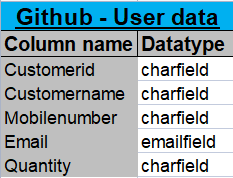
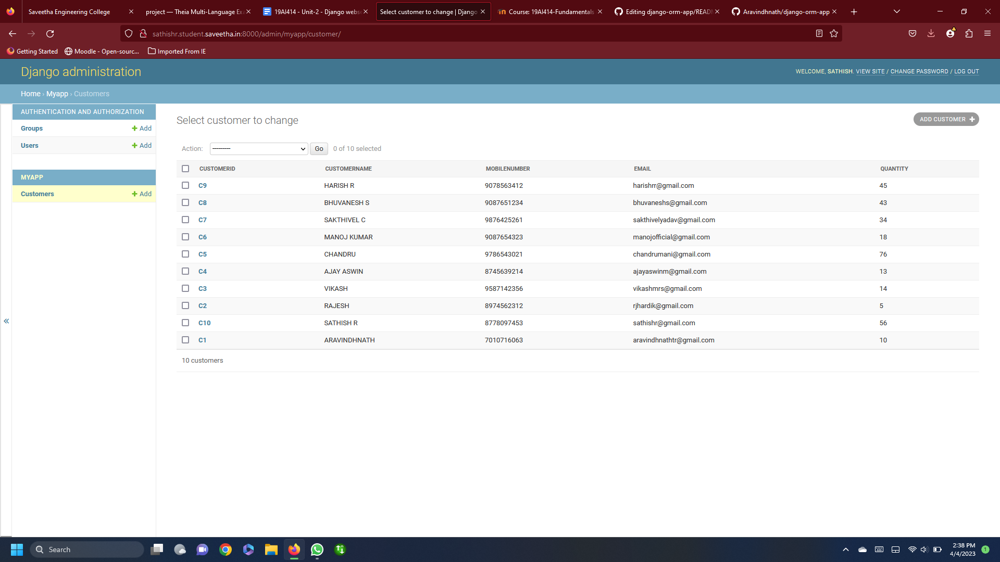

# Django ORM Web Application

## AIM
To develop a Django application to store and retrieve data from a database using Object Relational Mapping(ORM).

## Entity Relationship Diagram

## DESIGN STEPS

## STEP 1:

An Django application is created inside dataproject folder.
## STEP 2:

A python program is written to create a table to store and retrieve data.
## STEP 3:

The table is created with 6 fields in which the username field is made as PrimaryKey.
## STEP 4:

Then the project files migrated. A superuser is also created.
## STEP 5:

Now the server side program is executed .
## STEP 6:

The admin page of our website is accessed using username and password.
## STEP 7:

Records are added and saved in the table inside the database.


## PROGRAM

```
## models.py

from django.db import models
from django.contrib import admin
# Create your models here.
class Customer(models.Model):
    customerid = models.CharField(max_length=8,primary_key=True)
    customername =models.CharField(max_length=100)
    mobilenumber =models.CharField(max_length=100)
    email = models.EmailField()
    quantity= models.IntegerField()

class CustomerAdmin(admin.ModelAdmin):
    list_display = ('customerid','customername','mobilenumber','email','quantity')
```
```
###admin.py

from django.contrib import admin
from .models import Customer,CustomerAdmin

# Register your models here.
admin.site.register(Customer,CustomerAdmin)
```

## OUTPUT




## RESULT

Thus a Django application is successfully developed to store and retrieve data from a database using Object Relational Mapping(ORM).
